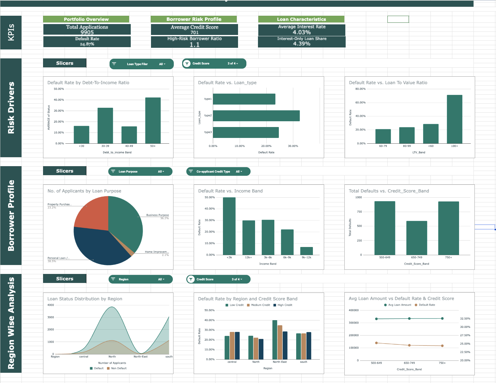

Loan Analytics Dashboard Dataset
Project Overview

This dataset provides a structured record of loan applications and borrower profiles. It is designed to support financial analysis, credit risk evaluation, lending trend analysis, and default prediction modeling.

The dataset captures borrower demographics, loan characteristics, credit attributes, and repayment risk indicators.

Dataset Analysis Screenshot

File Details

Filename: loan_default_dataset.csv
Total Records: (Insert your row count)
Primary Keys: ID

Data Dictionary
Column Name	Description	Data Type
ID	Unique identification number for each loan record	Integer
year	Year in which the loan was issued	Integer
loan_limit	Indicates loan limit classification (e.g., conforming)	Categorical
Gender	Borrower gender	Categorical
approv_in_adv	Whether loan was pre-approved	Categorical
loan_type	Type of loan structure	Categorical
loan_purpose	Purpose of the loan	Categorical
Credit_Worthiness	Borrower creditworthiness classification	Categorical
open_credit	Number of open credit lines	Integer
business_or_commercial	Indicates business/commercial loan usage	Categorical
loan_amount	Total loan amount issued	Float
rate_of_interest	Interest rate applied to the loan	Float
Interest_rate_spread	Spread relative to benchmark rate	Float
Upfront_charges	Initial charges at loan issuance	Float
term	Loan repayment duration (months)	Integer
Neg_ammortization	Negative amortization indicator	Categorical
interest_only	Interest-only payment indicator	Categorical
lump_sum_payment	Lump sum payment option indicator	Categorical
property_value	Value of the secured property	Float
construction_type	Property construction classification	Categorical
occupancy_type	Property occupancy classification	Categorical
Secured_by	Asset used as collateral	Categorical
total_units	Number of units in property	Integer
income	Borrower annual income	Float
credit_type	Credit scoring system used	Categorical
Credit_Score	Borrower credit score	Integer
co-applicant_credit_type	Co-applicant credit classification	Categorical
age	Borrower age group	Categorical
submission_of_application	Loan submission method	Categorical
LTV	Loan-to-Value Ratio	Float
Region	Borrower geographic region	Categorical
Security_Type	Type of security instrument	Categorical
Status	Loan default indicator (1 = Default, 0 = No Default)	Binary
dtir1	Debt-to-Income Ratio	Float
Key Insights & Statistics

Loan Characteristics: Includes multiple loan structures and repayment conditions

Credit Profiles: Wide range of borrower credit scores and worthiness levels

Risk Indicators: Features financial ratios such as LTV and DTI

Borrower Demographics: Covers gender, age groups, and regions

(Insert your calculated metrics if available)

Example:

Average Loan Amount:

Average Credit Score:

Default Rate:

Analysis Suggestions

Credit Risk Analysis: Examine how Credit_Score, LTV, and DTI influence default behavior

Interest Rate Trends: Analyze rate_of_interest variations across loan types

Borrower Profiling: Study income and credit patterns among borrowers

Default Drivers: Identify variables contributing to Status = 1

Regional Trends: Compare lending patterns across regions

Data Cleaning Notes

Missing Values: Some records may contain incomplete borrower or loan information

Filtering Strategy: Exclude rows with null critical identifiers (e.g., ID)

Normalization: Convert numeric fields and ratios into appropriate formats

Categorical Encoding: Standardize categorical labels where necessary

Generated For

Loan Dataset Dashboard and Analytics Study
